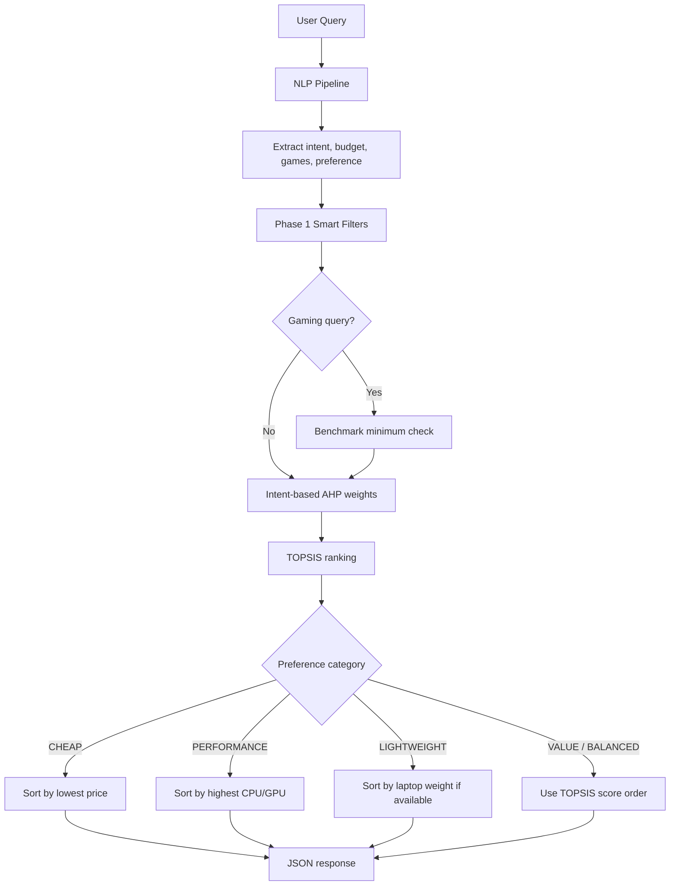

# Laptop Recommendation System API

Sistem rekomendasi laptop ini memakai pipeline hybrid:

1. NLP / NLU untuk memahami maksud user.
2. Rule-based filtering untuk menyaring kandidat yang relevan.
3. Benchmark checking untuk game atau use case yang punya minimum requirement.
4. AHP + TOPSIS untuk ranking final yang konsisten dan bisa dijelaskan.

Tujuan utama sistem ini adalah mengubah bahasa alami user menjadi struktur yang deterministik, bukan membiarkan model menebak laptop final secara bebas.

---

## Alur Pemrosesan

```text
User query
  -> NLP pipeline
  -> intent / budget / game / preference extraction
  -> Phase 1: smart filters
  -> benchmark filter (kalau gaming / use case tertentu)
  -> Phase 2: AHP weights
  -> TOPSIS ranking
  -> category-specific sorting
  -> JSON response
```

Endpoint utama yang dipakai frontend adalah `POST /api/recommend-hybrid`.

---

## Diagram Alur



---

## Quick Start

### 1. Install dependensi

```bash
cd "d:\projects\Sistem Rekomendasi laptop\Rekomendasi-Laptop-NLP"
pip install -r requirements.txt
```

### 2. Jalankan backend

```bash
python -m uvicorn app:app --host 127.0.0.1 --port 8000
```

### 3. Jalankan frontend statis

```bash
cd static
python -m http.server 3000
```

### 4. Buka aplikasi

- Frontend: `http://localhost:3000`
- API docs: `http://localhost:8000/docs`
- Health check: `http://localhost:8000/health`
- Debug info: `http://localhost:8000/debug`

---

## Struktur Proyek

```text
Rekomendasi-Laptop-NLP/
├── app.py                  # FastAPI app + pipeline orchestration
├── README.md               # Dokumentasi ini
├── requirements.txt        # Dependensi Python
├── launch.bat              # Helper startup lokal
├── static/
│   └── index.html          # Frontend UI
├── data/
│   ├── cleaned_dataset_v3.csv
│   ├── minimum_requirements_processed.csv
│   └── recommended_requirements_processed.csv
├── scripts/
│   ├── load_data.py
│   ├── build_kb.py
│   ├── build_laptop_kb.py
│   ├── build_unique_word_kb.py
│   ├── build_bigram_trigram_kb.py
│   ├── build_abbrev_alt_kb.py
│   ├── build_brand_models_kb.py
│   └── generate_series_kb.py
└── src/
    ├── nlp_pipeline.py
    ├── smart_filters_and_ahp.py
    ├── topsis_engine.py
    ├── recommender_system.py
    ├── recommender.py
    ├── recommender_core.py
    └── nlp_accelerated.py
```

---

## Modul Inti

### `app.py`

Orkestrasi endpoint FastAPI dan alur hybrid. File ini menangani:

- pemanggilan NLP
- smart filtering
- benchmark filtering
- AHP weighting
- TOPSIS ranking
- formatting response JSON

### `src/nlp_pipeline.py`

Mengekstrak maksud user dari query bebas:

- `found_games`
- `found_laptops`
- `budget`
- `ram`
- `app_intent`
- `preference_category`
- `has_game_context`

### `src/smart_filters_and_ahp.py`

Berisi:

- filter berbasis intent
- pembobotan AHP per intent
- template bobot untuk use case tertentu

### `src/topsis_engine.py`

Menghitung ranking final dengan TOPSIS:

- normalisasi matriks
- pembobotan
- solusi ideal positif / negatif
- jarak Euclidean
- skor preferensi

### `scripts/load_data.py`

Memuat CSV dan membangun knowledge base yang dipakai NLP serta benchmark lookup.

---

## Cara Kerja Sistem

### 1. NLP parsing

`src/nlp_pipeline.py` membaca query user dan mengekstrak:

- intent aplikasi
- game yang disebut
- budget
- RAM
- brand / model
- kategori preferensi

Kategori preferensi yang dikenali:

- `CHEAP` -> termurah, murah, harga paling rendah, low budget
- `PERFORMANCE` -> terkencang, tercepat, paling powerful
- `VALUE` -> terbaik, paling optimal, best value
- `LIGHTWEIGHT` -> teringan, paling ringan, paling enteng
- `BALANCED` -> default jika tidak ada preferensi eksplisit

### 2. Intent resolution

Prioritas intent di backend:

1. `app_intent` hasil NLP, misalnya `2D_DESIGN`, `AI_DEVELOPMENT`, `WEB_DEVELOPMENT`
2. gaming, kalau ada game atau konteks main game
3. `FIND_LAPTOP_GENERAL` sebagai fallback

### 3. Phase 1 filtering

`apply_smart_filters()` menyaring kandidat berdasarkan:

- intent
- budget
- RAM minimum
- brand
- game list

### 4. Benchmark checking

Kalau ada target benchmark yang dikenali di query, sistem membaca minimum requirement dari database lalu membuang laptop yang tidak memenuhi threshold CPU / GPU minimum.
Ini berlaku bukan hanya untuk query yang eksplisit bilang gaming, tetapi untuk semua query yang membawa target aplikasi/game yang punya data benchmark.

### 5. AHP weighting

`get_intent_based_weights()` memberi bobot sesuai intent.

Contoh:

- gaming: GPU dominan
- 2D design: CPU dominan
- AI development: GPU + RAM tinggi
- web development: CPU + RAM tinggi

Bobot selalu dinormalisasi ke total 1.0.

### 6. TOPSIS ranking

`run_topsis()` menghitung ranking dengan langkah:

1. normalisasi matriks keputusan
2. pembobotan
3. pencarian solusi ideal positif dan negatif
4. hitung jarak Euclidean ke ideal
5. hitung skor preferensi:

```text
C* = D- / (D+ + D-)
```

Semakin besar `C*`, semakin baik peringkat laptop.

### 7. Sorting tambahan per kategori

- `CHEAP` -> urut harga paling rendah
- `PERFORMANCE` -> urut CPU + GPU paling tinggi
- `LIGHTWEIGHT` -> aktif hanya jika dataset punya kolom bobot laptop; kalau tidak ada, diabaikan
- `VALUE` / `BALANCED` -> tetap memakai AHP + TOPSIS normal

---

## Kenapa Gaming Sekarang Lebih Akurat

Sebelumnya RAM bisa terlalu mempengaruhi ranking gaming. Sekarang jalur gaming memakai kriteria yang lebih fokus:

- `GPU_score`
- `CPU_score`
- `Final Price`

RAM dan storage tetap dipakai sebagai syarat minimum di filtering, bukan penentu utama ranking final.

Itu sebabnya laptop dengan RTX 3070 bisa naik di atas RTX 3060 kalau GPU memang lebih kuat dan CPU-nya setara.

---

## Supported Intents

Intent yang resmi dikenali di kode:

- `FIND_LAPTOP_FOR_GAME`
- `2D_DESIGN`
- `3D_DESIGN`
- `OLAH_DATA`
- `AI_DEVELOPMENT`
- `WEB_DEVELOPMENT`
- `MULTITASKING`
- `WORKSTATION`
- `ENTERTAINMENT`
- `VIDEO_EDITOR`
- `FIND_LAPTOP_GENERAL` sebagai fallback

---

## API Endpoints

### `POST /api/recommend-hybrid`

Request:

```json
{
  "query": "bantu aku mencari laptop untuk desain 2d terbaik di harga 20 juta",
  "top_n": 5,
  "nlp_mode": "auto"
}
```

Response inti:

```json
{
  "status": "success",
  "intent": "2D_DESIGN",
  "filtered_count": 411,
  "ranked_count": 411,
  "weights_applied": {
    "CPU": 0.3,
    "GPU": 0.15,
    "RAM": 0.25,
    "Storage": 0.12,
    "Price": 0.18,
    "Storage_Type_Bonus": 0.03
  },
  "recommendations": [
    {
      "rank": 1,
      "brand": "MSI",
      "model": "Pulse",
      "topsis_score": 0.7445,
      "specs": {
        "cpu_name": "Intel Core i7-11800H",
        "gpu_name": "RTX 3060",
        "ram": 32,
        "storage": 1000,
        "final_price": 18780795
      },
      "reasoning": "Rank #1: ..."
    }
  ]
}
```

### `GET /recommend`

Endpoint legacy untuk kompatibilitas query sederhana.

### `GET /debug`

Menampilkan status data yang sudah diload dan ukuran knowledge base.

### `GET /health`

Health check sederhana.

---

## Contoh Interpretasi Query

### Query desain 2D

```text
bantu aku mencari laptop untuk desain 2d terbaik di harga 20 juta
```

Hasil yang diharapkan:

- intent: `2D_DESIGN`
- budget max: `20 juta`
- goal: value / terbaik
- ranking mengikuti AHP 2D design

### Query gaming budget

```text
laptop untuk bermain black myth wukong di harga max 20 juta
```

Hasil yang diharapkan:

- intent: `FIND_LAPTOP_FOR_GAME`
- game: `Black Myth: Wukong`
- budget max: `20 juta`
- benchmark minimum game diterapkan dulu

### Query performance-first

```text
aku pengen laptop buat hi3, cs2, genshin, terbaik max 20jt
```

Hasil yang diharapkan:

- intent: gaming
- preference: performance / value sesuai kata yang dipakai
- ranking gaming fokus ke GPU + CPU

### Query bobot laptop

```text
laptop teringan
```

Kalau dataset tidak punya kolom bobot, preference ini diabaikan.

---

## Algoritma Matematis

### AHP weights

Bobot intent ditentukan secara manual per use case:

- gaming: GPU paling besar
- AI: GPU + RAM besar
- desain 2D: CPU dominan
- office / general: balanced

### TOPSIS

Misal matriks keputusan `X = [x_ij]`.

1. Normalisasi:

```text
r_ij = x_ij / sqrt(sum(x_ij^2))
```

2. Pembobotan:

```text
v_ij = w_j * r_ij
```

3. Ideal positif / negatif:

- benefit: max = ideal positif, min = ideal negatif
- cost: min = ideal positif, max = ideal negatif

4. Jarak ke ideal:

```text
D+ = sqrt(sum((v_ij - A+j)^2))
D- = sqrt(sum((v_ij - A-j)^2))
```

5. Skor preferensi:

```text
C* = D- / (D+ + D-)
```

Semakin besar `C*`, semakin baik posisi laptop.

---

## Data yang Dipakai

- `data/cleaned_dataset_v3.csv` -> data laptop utama
- `data/minimum_requirements_processed.csv` -> minimum requirement per game/app
- `data/recommended_requirements_processed.csv` -> recommended requirement per game/app

Kolom umum yang dipakai:

- Brand
- Model
- CPU
- GPU
- RAM
- Storage
- Storage type
- CPU_score
- GPU_score
- Final Price

Dataset saat ini tidak punya kolom bobot laptop fisik, jadi preference seperti `teringan` hanya bisa aktif kalau kolom itu memang tersedia.

---

## File Penting

- `app.py` -> routing API dan orchestration pipeline
- `src/nlp_pipeline.py` -> parsing intent dan preference
- `src/smart_filters_and_ahp.py` -> filtering + AHP weights
- `src/topsis_engine.py` -> ranking TOPSIS
- `scripts/load_data.py` -> load CSV dan knowledge base
- `static/index.html` -> UI frontend

---

## Notes Implementasi

- Frontend default mengarah ke `http://localhost:8000/api/recommend-hybrid`
- Backend dijalankan di port `8000`
- Frontend statis dijalankan di port `3000`
- NLP mode bisa `auto`, `cpu`, atau `gpu`
- `gpu` mode hanya aktif jika plugin akselerasi tersedia

---

## Pengembangan Lanjut

Kalau mau menaikkan akurasi pemahaman query, urutan pengembangan yang paling masuk akal adalah:

1. memperluas kamus sinonim di `src/nlp_pipeline.py`
2. menambah intent baru di `src/smart_filters_and_ahp.py`
3. menambah benchmark requirements di CSV
4. memakai LLM hanya sebagai parser cadangan untuk query yang gagal dipahami oleh aturan deterministik
